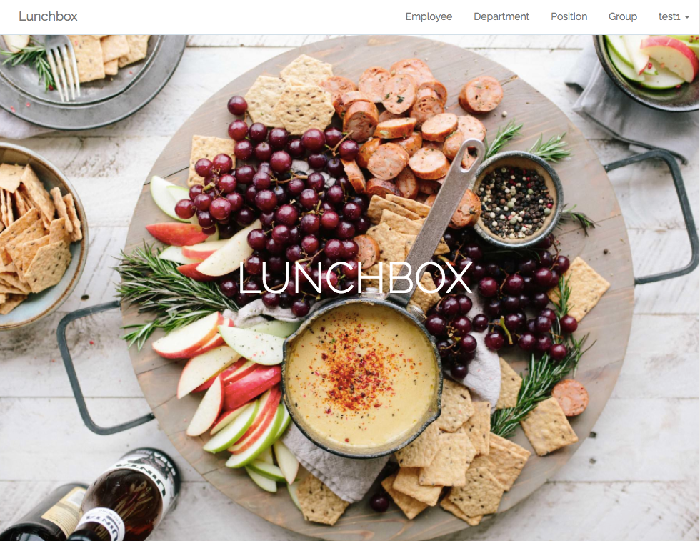

# Creative Lunchアプリ開発の裏側

---

## who am i

---

---

## Creative Lunchとは?

---

月に1度、社員で4〜5名のランチグループを作り社内交流を図るレアジョブの制度。

税抜き1500円までは会社が負担。

---

「4〜5名のランチグループ」

---

これって毎月誰が作成してるの？

---

### ＿人人人人人人人人人人人人人人＿ 
### ＞　HRチームが手作業で作成　＜ 
### ￣Y^Y^Y^Y^Y^Y^Y^Y^Y^Y^Y^Y^Y￣ 

---

## 辛み

---

開始当初は乱択でグループを自動生成していた。

が、徐々に次のようなクレームが増える。

---

- 同じ人と何度もグループになってる。偏りをなんとかして!
- 連続で調整役にされたけどどういうこと？
- 同じ部署の人と組むのは面白くないので他部署と組むようにしてほしい

<small>上記クレームに対応するには、過去データ参照しながら、手作業でグループ作るしかない(辛い...</small>

---

## エンジニアリングで解決しよう💪

---

---

## Demo

http://172.16.110.217:8000/

---

## アルゴリズム

---

ローテクな協調フィルタリング<small>のようなもの</small>

- 2者間の過去の履歴、プロフィールから評価値を算出
- 評価値を元に、もっともグループにふさわしいメンバーを選出する

---

二者間の評価値計算方法

- 参照するデータセットは、直近過去12ヶ月分のグループデータ
- 同じポジション(TM,TL,DH..)の場合 +1
- 同じ部署の場合 +2
- 過去12ヶ月にマッチしたことがある 回数*4

*評価点が低いほどその2者は接点が少ないので、できるだけ評価点の低いメンバー同士でグループを組ませれば良さげ

---

グループ選出手順

1. 全メンバーをシャッフル
1. グループ1人目: メンバーを上から順に各グループに一人入れるだけ
1. 2人目以降: 対象メンバーを全てのグループとの相関を比較し、もっとも適しているグループに順番に入れていく

---

調整役選出

1. グループ選出後に、そのグループの中で過去12ヶ月に最も調整役になった回数が少ない人のなかからランダム選出

<small>なので、新入社員は高確率で調整役になる...</small>

---

ソース

https://rsds.rarejob.com/app/techcamp2017-teamR/tree/dev_inoue

---

最後に

---

実はこれ、3月に行われたSDD勉強会のテーマだった。
2チームに別れてハッカソン形式で行われたが、全く完成にたどり着けず。

悔しかったので一人で全部完成させた。

おしまい

---
