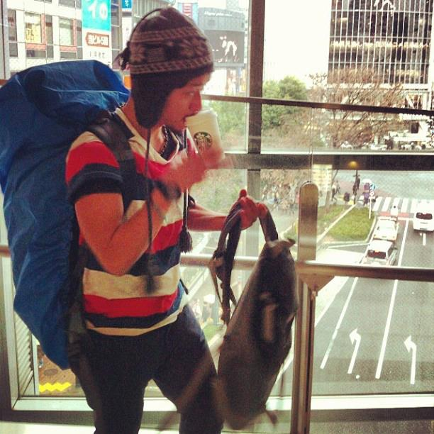

# Creative Lunchアプリ開発の裏側

---

## who am i

---

  
  
taishi inoue

  
最近はフロントエンドjs書いてます

---

## 今回の話

Creative Lunchアプリ作成の裏側

---

## Creative Lunchとは?

---

## 月に1度、社員で4〜5名のランチグループを作り社内交流を図る制度。

税抜き1500円までは会社が負担。

---

## 「4〜5名のランチグループ」

---

## どうやってグループ決めてる？

---

### ＿人人人人人人人人人人人人人人＿ 
### ＞　HRチームが手作業で作成　＜ 
### ￣Y^Y^Y^Y^Y^Y^Y^Y^Y^Y^Y^Y^Y￣ 

---

## 制度開始当初、グループは乱択で自動生成していた。

## が、徐々にクレームが増えてくる。

---

## よくあるクレーム 1

### 同じ人と何度も同じグループになった。偏らないようにして！

---

## よくあるクレーム 2

### 普段話さない他部署の人と組むようにして欲しい！

---

## よくあるクレーム 3

### 連続でランチの調整役にされた！調整役は平等に割り当てて欲しい！

---

## その結果

---

HRチームの担当者が毎月数時間かけてエクセル管理の過去データを参照しながらグループ分けを考えることに...

---

## エンジニアリングで解決しよう

---

Webアプリケーションを作った

---

## Demo

http://172.16.110.217:8000/

---

## マッチングアルゴリズム

---

レコメンダシステム

---

## ざっくり

- 毎月のグループ履歴をDBに保存
- 過去マッチング履歴、ユーザ基本情報からメンバー間の相関度合を数値化
- このスコアを元にグループを自動生成する

---

## メンバー間の評価値計算方法

- 参照するデータは、直近12ヶ月分のグループマッチデータ+現在のメンバー情報
- 同じポジション(TM,TL,DH..)の場合 スコア+1
- 同じ部署の場合 +2
- 過去12ヶ月にマッチしたことがある 回数*4

スコアが高い人 ≒ 交流がたくさんありそう

なのでスコアの低い人同士を組ませれば良い感じのグループになりそう

---

## グループ選出手順

1. 全メンバーの並びをシャッフル
1. 作成するグループ数分の箱(配列)を用意
1. グループ1人目(1順目): メンバーをグループ1から順に一人ずつ入れる
1. 2順目以降: 対象メンバーと各グループとの評価値を算出して比較し、もっとも適しているグループを探索しそこに入れる。これを最後の１人まで行う

---

## 調整役選出

グループ選出後に、そのグループの中で過去12ヶ月に最も調整役になった回数が少ない人のなかからランダム選出

<small>なので、新入社員は高確率で調整役になる...</small>

---

## ソース

https://rsds.rarejob.com/app/techcamp2017-teamR/tree/dev_inoue

---

## 雑感

- <strong>雑にアプリケーションを作るのは楽しい</strong>
- 実務では使っていないFW/ライブラリを積極的に使えるので、発見が多かった

---

## THANK YOU FOR LISTENING!
